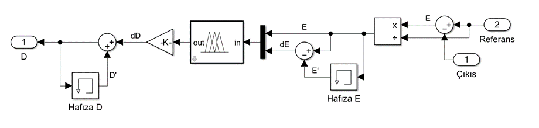
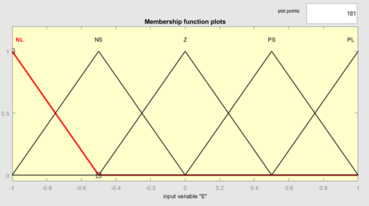
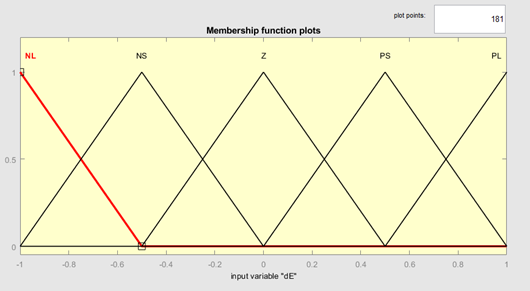
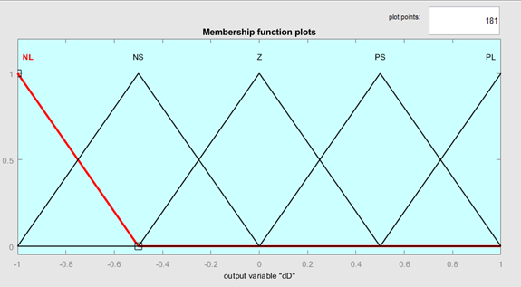
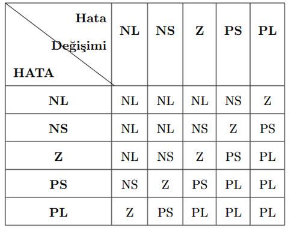
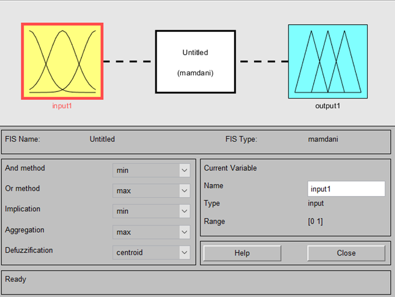
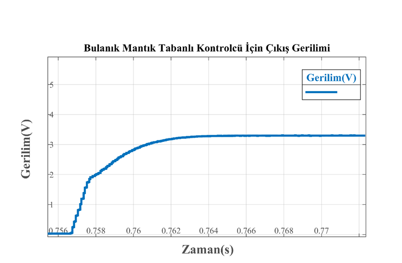
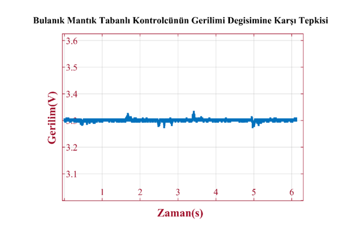
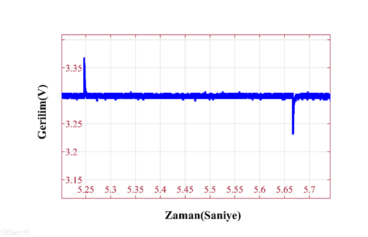

# Fuzzy Logic Based Control of DC-DC Converters

## Overview

This project presents the **design, simulation, and real-time implementation** of control methods for DC-DC converters, with a focus on **Fuzzy Logic Control (FLC)** applied to a buck converter.

The system is developed using MATLAB/Simulink and validated through embedded implementation.

📄 Full thesis available here:  
👉 [Turkish Thesis PDF](docs/thesis_tr.pdf)

---

## Motivation

DC-DC converters operate under:

- Nonlinear dynamics  
- Parameter uncertainties  
- Varying load conditions  

Classical controllers (PI, 3P3Z) may struggle under these conditions.

👉 This project explores **Fuzzy Logic Control** as a robust and adaptive alternative.

---

## System Architecture

<p align="center">
  
</p>

The control loop consists of:

1. Output voltage measurement  
2. Error and change of error computation  
3. Fuzzy logic inference  
4. PWM duty cycle generation  

---

## Fuzzy Logic Controller

### Membership Functions

<p align="center">
  
</p>

<p align="center">
  
</p>

<p align="center">
  
</p>

The fuzzy controller uses:

- Error (e)  
- Change of Error (Δe)  

### Rule Base

<p align="center">
  
</p>

### Fuzzy System Configuration

<p align="center">
  
</p>

- Inference Type: Mamdani  
- Defuzzification: Centroid  

---

## Simulation & Experimental Results

### Output Voltage Response

<p align="center">
  
</p>

### Response to Load Changes

<p align="center">
  
</p>

### Response to Resistance Variation

<p align="center">
  
</p>

---

## Embedded Implementation

The controller is implemented on:

- **STM32G474E-DPOW1**

System features:

- ADC-based voltage feedback  
- PWM signal generation  
- Real-time control execution  

---

## Key Results

- Stable voltage regulation under disturbances  
- Fast transient response  
- Low overshoot  
- High robustness against load and input variations  

---

## Technologies Used

- MATLAB / Simulink  
- Embedded Systems (STM32)  
- Power Electronics  
- PWM Control  
- Fuzzy Logic  

---

## Project Structure

## Project Structure

```
.
├── docs/
│   └── thesis_tr.pdf
├── images/
│   ├── Controller_Design.png
│   ├── Error_Membership.png
│   ├── Error_changing_membership.png
│   ├── Duty_Changing_Membership.png
│   ├── Rule_Table.png
│   ├── Fuzzy_Settings.png
│   ├── FLC_Voltage_Output.png
│   ├── FLC_Load_Changing_Performance.png
│   └── FLC_Resistor_Changing_Performance.png
└── README.md
```


---

## Conclusion

This project demonstrates that fuzzy logic control is a strong alternative to classical controllers for DC-DC converters, particularly in nonlinear and uncertain environments.

The approach is validated through both simulation and real-time embedded implementation.

---
